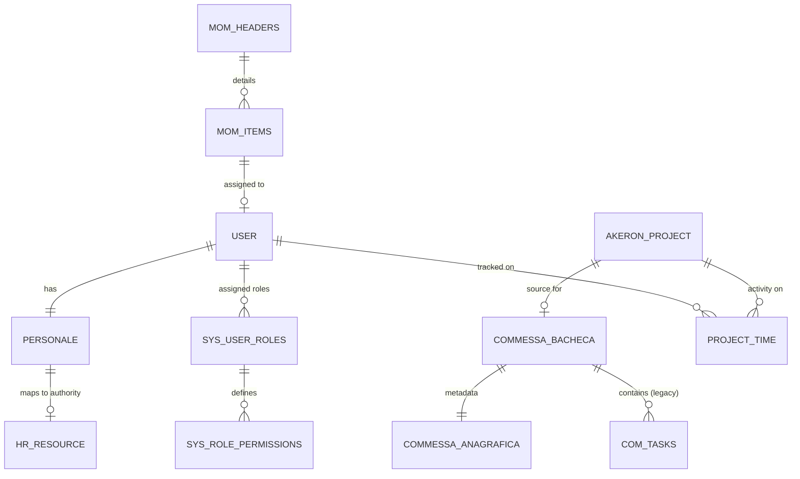

# 03 - Domain Model

Mappatura delle entità di business e delle loro relazioni nel database relazionale legacy.

## 1. Core Entities & Tables

### Utente & Personale

Relazione 1:1 tra account di login e anagrafica aziendale.

- **Table `users`**: Credenziali, stato account, role_id legacy.
- **Table `personale`**: Profilo intranet, bio, immagine, link a `Cod_Operatore`.
- **Table `hr_resource`**: Dati "authority" provenienti dal sistema HR (Reparto, Business Unit, Data Assunzione).
- **Relazioni**: `users.id` -> `personale.user_id`, `personale.Cod_Operatore` -> `hr_resource.id_hresource`.

### Commessa (Project)

Struttura complessa dovuta all'integrazione con sistemi esterni.

- **Table `akeron_project`**: "Source of Truth" per codici commessa e descrizioni commerciali.
- **Table `commesse_bacheche`**: Definisce l'esistenza di una board operativa nell'intranet.
- **Table `commesse_anagrafica`**: Dati tecnici (Importo, Date Inizio/Fine, Referente).
- **Table `project_time`**: Link utenti <-> commesse (assegnazioni).

### Tasks (Gestione Operativa)

- **Table `sys_tasks`**: Modulo "Moderno" per task trasversali (context: commessa, gara, user).
- **Tables `com_[slug]`**: Tabelle dinamiche create per ogni commessa bacheca (Legacy Pattern).

### Collaborazione

- **MOM (Verbali)**: `mom_headers` (testata verbale) e `mom_items` (singole decisioni/task nel verbale).
- **Contacts**: `anagrafiche_contatti` (Contatti esterni legati a clienti/fornitori).

---

## 2. Diagramma Relazionale (Sommario)

---

## 3. Naming Conventions & Mapping Next.js

Per la migrazione TypeScript, si suggerisce il seguente mapping:

| Entità Legacy | Tabella DB            | Nome Proposto TS | Note                                |
| :------------ | :-------------------- | :--------------- | :---------------------------------- |
| Utente        | `users`               | `User`           | Da integrare con Better Auth.       |
| Risorsa Staff | `hr_resource`         | `StaffResource`  | Sola lettura (Authority).           |
| Commessa      | `commesse_anagrafica` | `Project`        | Join con `akeron_project`.          |
| Task          | `sys_tasks`           | `Task`           | Unificare `com_X` in questo schema. |
| Verbale       | `mom_headers`         | `MeetingMinute`  | -                                   |

---

## 4. Problematiche Identificate

1. **Multi-Source for Users**: I dati utente sono sparsi su 3 tabelle (`users`, `personale`, `hr_resource`). Necessaria una View SQL o un aggregation layer in Next.js.
2. **Dynamic Tables**: Le tabelle `com_X` rendono difficile l'uso di Prisma. Soluzione: Migrare i dati in `sys_tasks` con un `context_id`.
3. **Collation**: Verificare che Next.js/Prisma gestiscano correttamente il mix di collation (`utf8mb4_unicode_ci`) rilevato nel database.
